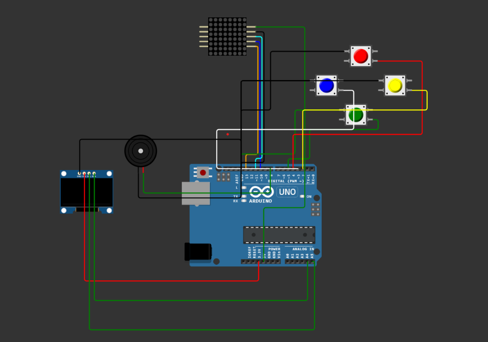

# Trò chơi rắn săn mồi
[Project trên Wokwi](https://wokwi.com/projects/383641267625734145)

## Video demo:

## Phần cứng
- 1 Arduino Uno
- 1 ma trận LED 8x8
- 4 nút điều khiển (Lên, Xuống, Trái, Phải)
- 1 loa 
- 1 oled ssd1306
Sơ đồ ghép nối các thiết bị:


## Thư viện
- LedControl: Hiển thị giao diện trò chơi trên ma trận Led 8x8
- Adafruit SSD1306: Hiển thị điểm trên màn hình LCD

## Code
### Mô hình táo và rắn
Màn hình trò chơi được biểu diễn bởi mảng 2 chiều 8x8 có hệ tọa độ như trong hình dưới đây:

Mỗi LED được biểu diễn bởi 1 struct *Point* có 2 trường thuộc tính *rPos* và *cPos* thể hiển chỉ số hàng và chỉ số cột của LED đó:
```
struct Point {
    int rPos; // The row of the point
    int cPos; // The column of the point
    ...
}
```
Táo được biểu diễn dưới dạng 1 *Point*.

Rắn được biểu diễn bởi một mảng *Point* theo thứ tự từ đuôi đến đầu. Ngoài ra, rắn cũng cần một mảng 2 chiều thể hiện hướng di chuyển của mình theo hàng và theo cột và một biến thể hiện chiều dài của rắn. Tất cả thông tin này được lưu vào trong struct *Snake* như sau:
```
struct Snake {
    Point body[MAX_SCORE]; // An array that contains the coordinates of the the snake's body
    int len;         // The length of the snake 
    int dir[2];      // A direction to move the snake along
    ...
}
```
### Vòng lặp game
Vòng lặp chính của game gồm 4 bước:
- Đọc đầu vào từ các nút bấm, nếu có (*readInstruction*)
- Cập nhật các thuộc tính của táo và rắn (*Update*)
- Hiển thị màn hình game trên ma trận LED (*Render*)
- Hiển thị điểm số của game trên màn hình LCD (*displayGameState*)

Khi trò chơi kết thúc, người dùng có thể bấm 1 nút bất kỳ để bắt đầu ván chơi mới

### Di chuyển của rắn
Dựa vào hướng di chuyển và vị trí đầu cũ của rắn có thể tính được vị trí đầu mới của rắn.

Như đã nói ở phần trên, mảng **body** được lưu theo thứ tự từ đuôi tới đầu. Điều này thuận lợi cho việc cập nhật khi rắn di chuyển bởi ta chỉ cần dịch trái mảng này và thêm đầu mới vào cuối mảng này (thêm vào cuối 1 mảng dễ hơn so với thêm vào đầu). 

Ngoài ra, rắn phải kiểm tra hai trường hợp có thể xảy ra khi di chuyển:
- Rắn tự đâm vào bản thân: Lặp qua mảng body, kiểm tra xem xem có vị trí nào trùng với đầu mới không 
- Rắn ăn táo: Kiểm tra vị trí của táo có trùng với vị trí của đầu rắn không. Trong trường hợp rắn ăn được táo thì chỉ cần thêm vị trí mới này vào cuối mảng **body**

### Hiển thị trên ma trận LED 8x8
Đầu tiên, màn hình LED sẽ được xóa trắng. Sau đó, tọa độ của các LED hiển thị mới được tính thông qua táo và rắn. Cuối cùng, sử dụng thư viện *LedControl* để cập nhật các thay đổi này

Táo có tốc độ hiển thị (*updateRate*) nhanh gấp 2 so với rắn để tạo hiệu ứng nhấp nháy.


### Loa
Loa sẽ phát ra 3 tiếng kêu khác nhau tương ứng với 3 sự kiện:
- Rắn ăn được táo (**EAT**)
- Rắn chết (**DIE**)
- Rắn thắng (**WIN**)
